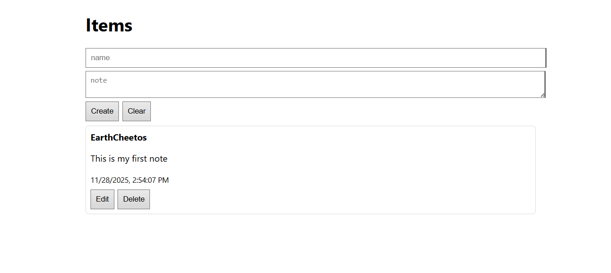
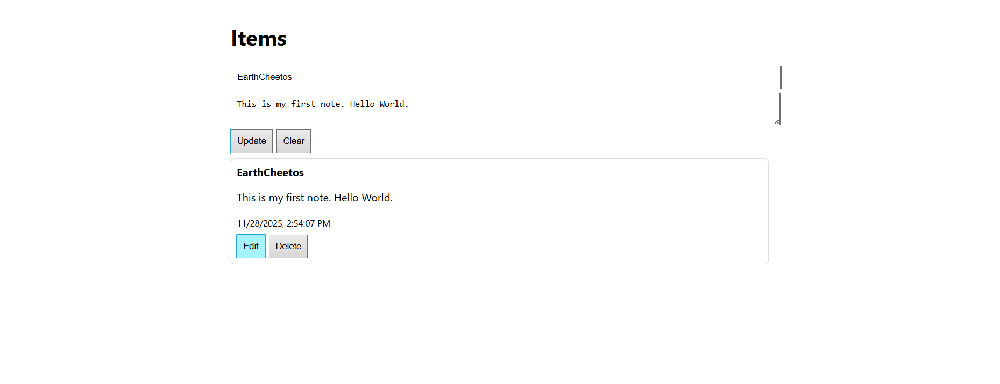

# MEVN Memorize (Simple Vue + Node + MongoDB CRUD App)

A lightweight MEVN stack CRUD application built for learning and memorizing full-stack development workflow.
This project demonstrates how Vue 3 works together with an Express API and MongoDB database.

Perfect for beginners and as a reference template for future MEVN projects by  [](https://github.com/earthcheetos)

# Tech Stack
**Frontend**
- Vue 3 (CDN build)
- HTML + CSS (simple layout)

**Backend**
- Node.js
- Express.js
- Mongoose (MongoDB ODM)

**Database**
- MongoDB (local)

# Project Structure
```bash
mevn-memorize/
│
├── server/
│   ├── server.js          # Express server + API routes
│   └── models/
│       └── Item.js        # Mongoose schema
│
├── public/
│   └── index.html         # Vue 3 frontend
│
├── package.json
└── README.md
```
# Installation & Setup
**Clone the repository**
```bash
git clone https://github.com/YOUR-USERNAME/mevn-memorize.git
cd mevn-memorize
```
**Install dependencies**
```bash
npm install
```
**Start MongoDB**
Make sure MongoDB service is running:
```bash
mongod
```
**Start server**
```bash
node server/server.js
```
You should see:
```bash
Server on 4000
Mongo connected
```
**Open the app**
Visit:
```bash
http://localhost:4000
```
**Features**
- Create notes
- Edit notes
- Delete notes
- Auto-fetch latest items
- Clean and simple UI
- Easy to understand CRUD code

**API Endpoints**
**GET /items**
Retrieve all items.

**POST /items**
Create a new item.
```JSON
Body:

{
  "name": "example",
  "note": "sample note"
}
```
**PUT /items/:id**

Update an item.

**DELETE /items/:id**

Delete an item by ID.

# How it Works?
**Frontend (Vue)**
- Uses Vue 3’s reactive system (ref, reactive)
- Fetch API communicates with the backend
- Auto refreshes the item list after CRUD operations

**Backend (Node.js)**
- Express handles API routing
- Mongoose manages MongoDB documents
- Middleware parses JSON data

**Database (MongoDB)**

Stores items with fields:
```JSON
{
  name: String,
  note: String,
  createdAt: Date
}
```
# My screenshots

**Main page**


**Create note**


**Update note**


# Troubleshooting
**Cannot PUT /items/:id**

Your Express server may not have the update route or app.use(express.json()).
Double-check your backend code.

**CORS issues**
Use:
```bash
npm install cors
```
Then:
```JSON
app.use(cors());
```
**MongoDB not connecting**

Make sure MongoDB service is running:
```bash
mongod
```
**Future Improvements**
- Add user authentication
- Add search/filter system
- Convert Vue CDN to Vite project
- Deploy on Render / Netlify

**License**
This project is open-source and available under the MIT License.

# Thank you for checking out this project! 
